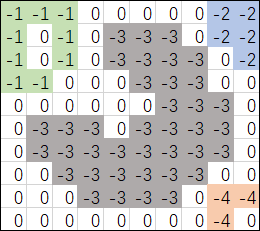
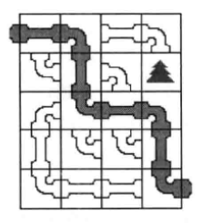

## 啊哈!算法  aha-algorithm  

主要是书本内容的算法的再现
原书籍代码采用c 编写，本案例采用其他语言实现 并解释其原理.

#### 第一章节
* 桶排序 -将数据插入桶中自动排序  
* 冒泡排序  两遍for循环  
* 快速排序  递归算法  

#### 第二章节
* 队列 FIFO  
* 栈   FILO  
* 纸牌游戏 小猫钓鱼  
* 链表  
* 模拟链表

#### 第三章节 枚举！ 很暴力
* 枚举算法  穷举算法  坑爹的奥数题
* 有序的去尝试每一种可能  

* 爆炸人小游戏 求出炸弹最合适的为止  [JAVA](./src/main/java/indi/hbn/algorithm/ahaalgorithm/chapter3/_1Bomber.java)
* 火柴棍等式 [JAVA](./src/main/java/indi/hbn/algorithm/ahaalgorithm/chapter3/_2Matchstick.java)
* 数的全排列 [JAVA](./src/main/java/indi/hbn/algorithm/ahaalgorithm/chapter3/_3FullPermutationofnumbers.java)

#### 第四章 万能的搜索 
* 不撞南墙不回头--深度优先搜索 [Depth-First-Search](./src/main/java/indi/hbn/algorithm/ahaalgorithm/chapter4/_1DepthFirstSearch.java)
* 解救小哈  [Java](./src/main/java/indi/hbn/algorithm/ahaalgorithm/chapter4/_2saveXiaoHa.java)                            
* 层层递进--广度优先搜索  [Breadth First Search](./src/main/java/indi/hbn/algorithm/ahaalgorithm/chapter4/_3BreadthFirstSearch.java)
* 再解炸弹人  [Java](./src/main/java/indi/hbn/algorithm/ahaalgorithm/chapter4/_4bomb_Two.java)
* 宝岛探险  [JavaDFS](./src/main/java/indi/hbn/algorithm/ahaalgorithm/chapter4/_5BaoDaoBFS.java)
* 宝岛探险  [JavaBFS](./src/main/java/indi/hbn/algorithm/ahaalgorithm/chapter4/_5BaoDaoDFS.java)
*   
* 水管工游戏  [Java](./src/main/java/indi/hbn/algorithm/ahaalgorithm/chapter4/_6PlumberGame.java)
*   
*   

#### 第五章 图的遍历
* 深度和广度优先究竟是指啥
* 城市地图--图的深度优先遍历
* 最少转机--图的广度优先遍历

#### 第六章 最短路径
* 只有五行的算法--Floyd-Warshall
* Dijkstra算法--单源最短路
* Bellman-Ford--解决负权边
* Bellman-Ford的队列优化
* 最短路径算法分析

#### 第七章 神奇的树
* 开启"树"之旅
* 二叉树
* 堆--神奇的优先队列
* 擒贼先擒王--并查集

#### 第八章 更多精彩算法
* 镖局运镖--图的最小生成树
* 再谈最小生成树
* 重要城市--图的割点
* 关键道路--图的割边
* 我要做月老--二分图最大匹配

#### 第九章 还能更好么--微软亚洲研究院面试

#### 其他   
欢迎提交代码,当然了我们也非常重视文档。

