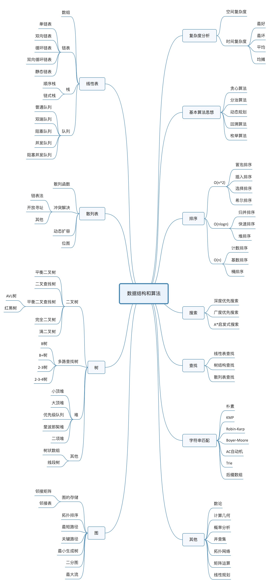

# Algorithm

算法 刷题就好

## Leetcode专区  
LeetCode  网站题目解析  [详见](./LeetCode)

## AHaAlgorithms 啊哈算法    
书籍内部经典案例的再现，使用java实现

## 数据结构

## 贡献
如果你有更好代码或者是算法相关专题(当然我们也非常的重视文档),你可以fork 修改测试后 pull requset to me,如果你对这个玩意非常感兴趣，可以将你加入到
collaborator.  
作为贡献者 你可以在这里留下你的名字.
贡献请阅读([Contributing](./CONTRIBUTING.md))
